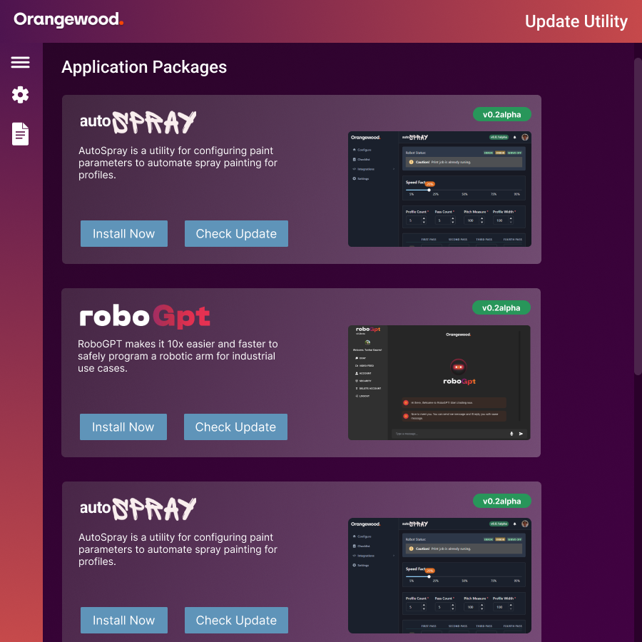

# Orangewood Labs App Update Utils
[](https://opensource.org/licenses/)

A desktop app for installing and managing Orangewood's apps.



### Tech Stack
This app is build using:
- [Tauri](https://tauri.app/)
- [Next.js](https://nextjs.org/)
- [Tailwind](https://tailwindcss.com/)

<iframe style="border: 1px solid rgba(0, 0, 0, 0.1);" width="600" height="450" src="https://embed.figma.com/design/9IPtdeU8YE96Kfe04N6fSI/OWLUpdateUtils?node-id=0-1&embed-host=share" allowfullscreen></iframe>

### Running in Development Mode
Please follow this guide to install the prerequisites (example Rust):
https://tauri.app/v1/guides/getting-started/prerequisites

Clone the project

```bash
  git clone https://github.com/tushgaurav/OWLAppUpdater
```

Go to the project directory

```bash
  cd OWLAppUpdater
```

Install dependencies

```bash
  npm install
```

Start the app

```bash
  npm run tauri dev
```